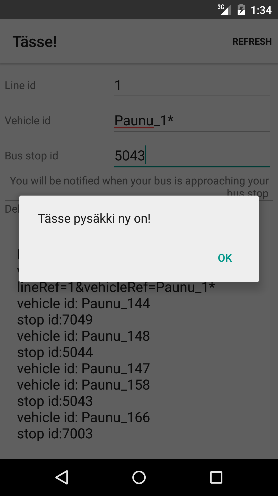

Android Tässe! 
===================================
A _2015 Tampere #opendata Makes You Move Hackathon_ -inspired app.

This app will show you a notification when the specified bus on a specified line is approaching the specified bus stop. The currently only check the next bus stop the vehicle is approach.

This is app based on Android NetworkConnect sample app licensed under Apache License 2.0. The major changes made to the sample app include:

- Connecting to and parsing Tampere Journeys API JSON data: http://wiki.itsfactory.fi/index.php/Journeys_API
- New UI

Screenshots
-------------

TODO
------------

- repeat refresh at certain intervals - and even if the app is on the background
- let user select the bus stop by name
- automatically guess the vehicle the user is in
- play audible notification if the screen is off or the app is on the background
- localization
- lots of refactorings
- test

Dependencies
--------------

- Android SDK v23
- Android Build Tools
- Android Support Library v4
- JUnit

Getting Started
---------------

This app uses the Gradle build system. To build this project, use the
"./gradlew build" command or use "Import Project" in Android Studio.
